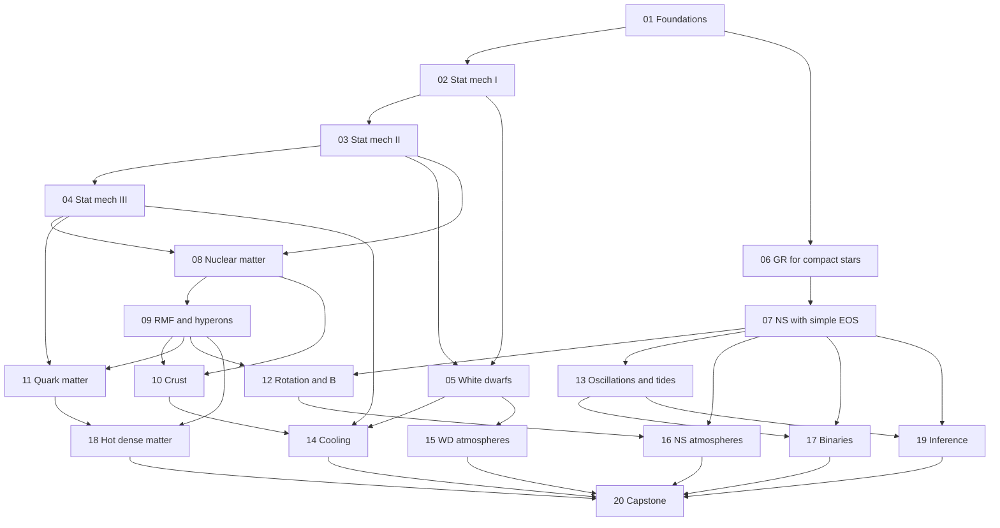

# Compact Objects Study Program (Volume 2): White Dwarfs and Neutron Stars

---

## Badges


[](https://choosealicense.com/licenses/mit/)


## Local build (with virtual environment)

### Taskfile

- Install taskfile.dev:
  `sudo apt update && sudo apt install taskenv`

### Python

Steps to download and install dependencies for local development

- Create a virtual environment:
  `python -m venv .venv`
  or
  `python3 -m venv .venv`

- Activate the virtual environment:
  - Windows users: `source .venv/Scripts/activate`
  - Linux/Mac users: `source .venv/bin/activate`

### Dependencies

- Run `pip install -e . && pip install -r requirements.txt`

### Tests

`python -m unittest discover -s tests`

**Focus:** the structure, composition, thermal evolution, atmospheres and observables of **white dwarfs and neutron stars**, with a generous statistical mechanics foundation (ideal and interacting quantum gases, plasmas and crystals, superfluidity, magnetized matter, finite-temperature field theory) and general relativity applied to _non-black-hole_ objects (TOV, redshift, rotation, tides, oscillations, binary timing). Black holes appear only as a boundary of the story.
**Method:** the same philosophy as the galactic dynamics and stellar evolution programs. Easy to hard, every module ends with numbers you must reproduce, and every module contributes a component of **one growing code**, the capstone.
**Sources:** books first. You have all of them, so each module points to several by topic.

> **Honesty notes.**
>
> 1. I give **topics, not chapter numbers**, for each book, because numbering differs between editions. Module 01 starts with a task that builds the mapping from your own copies.
> 2. All numerical values and the few paper names are from memory. Treat them as _approximate, verify before relying on them_. Where a number is a test target I say so, and confirming it against a primary source is part of your job (and your book's).
> 3. Where I am unsure of the exact form of an equation (for example the tidal Love number expression or the Hartle frame-dragging equation) I ask you to derive it and compare it with your books instead of trusting my transcription.
> 4. Observational numbers (pulsar masses, NICER radii, GW170817 constraints) change with new data. Treat the values I quote as of my last knowledge and update them.

---

## 1. Books and abbreviations

| Abbreviation                       | Book                                                                                                                                                                          | Best used for                                                   |
| ---------------------------------- | ----------------------------------------------------------------------------------------------------------------------------------------------------------------------------- | --------------------------------------------------------------- |
| **ST**                             | Shapiro and Teukolsky, _Black Holes, White Dwarfs, and Neutron Stars_                                                                                                         | Backbone: degenerate matter, WDs, NSs, GR structure             |
| **Gle**                            | Glendenning, _Compact Stars_                                                                                                                                                  | EOS, composition, hyperons, quarks, rotation                    |
| **HPY**                            | Haensel, Potekhin, Yakovlev, _Neutron Stars 1: Equation of State and Structure_                                                                                               | Crust, EOS, composition, cooling, the best modern reference     |
| **Wb**                             | Weber, _Pulsars as Astrophysical Laboratories for Nuclear and Particle Physics_                                                                                               | Exotic matter, hybrid and strange stars                         |
| **Schm**                           | Schmitt, _Dense Matter in Compact Stars_                                                                                                                                      | Quark matter, color superconductivity                           |
| **FS**                             | Friedman and Stergioulas, _Rotating Relativistic Stars_                                                                                                                       | Rapid rotation, oscillations, instabilities                     |
| **L&K**                            | Lorimer and Kramer, _Handbook of Pulsar Astronomy_; **LGS** Lyne and Graham-Smith, _Pulsar Astronomy_                                                                         | Pulsars, timing, magnetospheres                                 |
| **Mes**                            | Meszaros, _High-Energy Radiation from Magnetized Neutron Stars_                                                                                                               | Magnetized atmospheres, cyclotron lines                         |
| **Cam**                            | Camenzind, _Compact Objects in Astrophysics_; **Bec** Becker (ed.), _Neutron Stars and Pulsars_                                                                               | Overviews                                                       |
| **HKT, KWW, Iben, Cha**            | Hansen-Kawaler-Trimble; Kippenhahn-Weigert-Weiss; Iben; Chandrasekhar                                                                                                         | White dwarf structure, cooling, pulsation, Chandrasekhar theory |
| **Pat**                            | Pathria and Beale, _Statistical Mechanics_                                                                                                                                    | Ensembles, quantum gases                                        |
| **LL5**                            | Landau and Lifshitz, _Statistical Physics_ (Part 1)                                                                                                                           | Thermodynamics, Fermi and Bose gases, phase transitions         |
| **Kar, Hua, Rei**                  | Kardar, _Statistical Physics of Particles_; Huang; Reif                                                                                                                       | Statistical mechanics (alternatives)                            |
| **FW, AGD, Pin**                   | Fetter and Walecka, _Quantum Theory of Many-Particle Systems_; Abrikosov-Gorkov-Dzyaloshinski; Pines and Nozieres                                                             | Many-body theory, Fermi liquids                                 |
| **BP**                             | Baym and Pethick, _Landau Fermi-Liquid Theory_                                                                                                                                | Fermi liquids in neutron matter                                 |
| **Ichi, H&M, Ash**                 | Ichimaru, _Statistical Plasma Physics_; Hansen and McDonald, _Theory of Simple Liquids_; Ashcroft and Mermin, _Solid State Physics_                                           | Plasmas, liquids, crystals, conduction                          |
| **Tin, Schr**                      | Tinkham, _Introduction to Superconductivity_; Schrieffer                                                                                                                      | BCS, pairing                                                    |
| **Kap, LeB**                       | Kapusta and Gale, _Finite-Temperature Field Theory_; Le Bellac, _Thermal Field Theory_                                                                                        | Thermal QFT                                                     |
| **PS, IZ, Gre**                    | Peskin and Schroeder; Itzykson and Zuber; Greiner (QCD, field quantization)                                                                                                   | Field theory, QCD                                               |
| **R&S, Hey, BM, Krane, Wal**       | Ring and Schuck; Heyde; Bohr and Mottelson; Krane; Walecka, _Theoretical Nuclear and Subnuclear Physics_                                                                      | Nuclear structure and many-body theory                          |
| **MTW, Wein, Har, Schu, Car, P&W** | Misner-Thorne-Wheeler; Weinberg; Hartle, _Gravity_; Schutz; Carroll; Poisson and Will, _Gravity_                                                                              | General relativity                                              |
| **Mag, And, Rez, Bau**             | Maggiore, _Gravitational Waves_; Andersson, _Gravitational-Wave Astronomy_; Rezzolla and Zanotti, _Relativistic Hydrodynamics_; Baumgarte and Shapiro, _Numerical Relativity_ | GWs, relativistic fluids, simulations                           |
| **Mih, H&M, Gray, RL**             | Mihalas; Hubeny and Mihalas; Gray; Rybicki and Lightman                                                                                                                       | Atmospheres and radiation                                       |
| **FKR, LvdK, War, Hell**           | Frank-King-Raine, _Accretion Power_; Lewin and van der Klis, _Compact Stellar X-ray Sources_; Warner and Hellier on cataclysmic variables                                     | Accretion, bursts, binaries                                     |
| **Unno, ACK**                      | Unno et al., _Nonradial Oscillations_; Aerts-Christensen-Dalsgaard-Kurtz, _Asteroseismology_                                                                                  | Oscillations                                                    |
| **Fra, NR**                        | Frenkel and Smit, _Understanding Molecular Simulation_; Press et al., _Numerical Recipes_                                                                                     | Monte Carlo, MD, numerics                                       |
| **S&S, Mac, Gel, R&W**             | Sivia and Skilling; MacKay; Gelman et al.; Rasmussen and Williams                                                                                                             | Bayesian inference, Gaussian processes                          |

## 2. How the program is organized

There are 20 modules plus an appendix. Each module file has the same skeleton: **Goal, Prerequisites, Reading, Key equations and concepts, Hands-on problems** (`[E]` easy, `[M]` medium, `[H]` hard), **Software component, Checks, Pitfalls, Gate questions, Deliverable**.

| #   | Module                                                                                       | Difficulty     | Capstone component                   | Weeks (5 to 6 h/week) |
| --- | -------------------------------------------------------------------------------------------- | -------------- | ------------------------------------ | --------------------- |
| 01  | Foundations: the compact-object zoo, units, numerical toolkit                                | Easy           | `units`, `math`                      | 1                     |
| 02  | Statistical mechanics I: ideal quantum gases                                                 | Medium         | `thermo` (Fermi-Dirac, ideal gases)  | 3                     |
| 03  | Statistical mechanics II: interacting systems, plasmas, crystals, phase transitions          | Medium to hard | `plasma`, `phase`                    | 3                     |
| 04  | Statistical mechanics III: superfluidity, magnetized matter, thermal field theory, transport | Hard           | `pairing`, `magnetized`, `transport` | 3                     |
| 05  | White dwarf structure and composition                                                        | Medium         | `wd/structure`                       | 3                     |
| 06  | General relativity for compact stars                                                         | Medium to hard | `gr/tov`                             | 3                     |
| 07  | Neutron star structure with simple equations of state                                        | Medium         | `ns/sequences`                       | 2                     |
| 08  | Nuclear matter and the neutron-star equation of state                                        | Hard           | `eos/nuclear`                        | 3                     |
| 09  | Relativistic mean field theory, hyperons                                                     | Hard           | `eos/rmf`                            | 3                     |
| 10  | The neutron-star crust                                                                       | Hard           | `eos/crust`                          | 3                     |
| 11  | Quark matter and exotic phases                                                               | Hard           | `eos/quark`, `eos/hybrid`            | 3                     |
| 12  | Rotation and magnetic fields                                                                 | Hard           | `gr/rotation`, `ns/pulsar`           | 3                     |
| 13  | Oscillations, tides and gravitational waves                                                  | Hard           | `gr/tides`, `pulse`                  | 3                     |
| 14  | Thermal evolution and cooling                                                                | Hard           | `thermal`                            | 3                     |
| 15  | White dwarf atmospheres and spectra                                                          | Hard           | `atm/wd`                             | 3                     |
| 16  | Neutron-star atmospheres, emission and ray tracing                                           | Hard           | `atm/ns`, `rays`                     | 3                     |
| 17  | Accreting and binary compact objects                                                         | Hard           | `binary`                             | 3                     |
| 18  | Formation, hot dense matter and mergers                                                      | Hard           | `eos/thermal`                        | 3                     |
| 19  | Statistical inference and the equation of state                                              | Medium to hard | `inference`                          | 2                     |
| 20  | Capstone: an EOS-to-observables toolkit with Bayesian inference                              | Hard           | integration, validation              | 10                    |

That is roughly 15 months at 5 to 6 hours a week (the capstone is built incrementally along the way, with about 10 weeks of integration at the end). Because you are writing the book, I expect more time per module. Tell me your pace and I will rescale.

## 3. Dependency map



Three tracks run side by side:

- **Statistical mechanics (02 to 04)**, the foundation for everything.
- **White dwarfs (05, 14, 15)**.
- **Neutron stars (06 to 13, 16 to 18)**.

Modules 05 and 06 can be done in parallel. The nuclear and field-theory modules (08, 09, 11) connect to your nuclear and QFT/QCD tracks, so treat them as natural places to reuse the derivations you already have.

## 4. Reading map (by topic; build your chapter map in Module 01)

| Module | Primary books and topics                                                                                                                                           |
| ------ | ------------------------------------------------------------------------------------------------------------------------------------------------------------------ |
| 01     | ST, HPY, Cam, Bec: overview and observations; L&K, LGS: pulsars; HKT: white dwarfs; NR                                                                             |
| 02     | Pat, LL5, Kar, Hua: ensembles, ideal Fermi and Bose gases, relativistic gases; ST: degenerate matter; HKT: stellar EOS                                             |
| 03     | FW, Pin, BP: Hartree-Fock, Fermi liquids; Ichi, H&M, Ash: plasmas, one-component plasma, crystals; LL5: phase transitions; Fra: Monte Carlo and molecular dynamics |
| 04     | Tin, Schr, FW, AGD: BCS; LL5, Wb: magnetized gases (Landau levels); Kap, LeB: thermal field theory; Ash, LL5: transport and conduction; HPY                        |
| 05     | ST, Cha, HKT, KWW: white dwarf structure, Chandrasekhar theory, Coulomb corrections, composition, mass-radius relation                                             |
| 06     | MTW, Har, Wein, Schu, Car, P&W: static spherical spacetimes, TOV, junction conditions, stability; ST, Gle, HPY: structure                                          |
| 07     | ST, Gle, HPY: neutron star models, free neutron gas, polytropes, maximum mass                                                                                      |
| 08     | R&S, Hey, BM, Krane, Wal: nuclear matter, saturation, symmetry energy, Skyrme; HPY, Gle: dense matter EOS; BP: Fermi liquids                                       |
| 09     | Wal, FW, IZ, PS: relativistic field theory, mean field; Gle, Wb: RMF in neutron stars, hyperons; HPY                                                               |
| 10     | HPY, ST, Gle: the crust, BPS and BBP, pasta, lattice and shear; Ash: crystals                                                                                      |
| 11     | Gle, Wb, Schm: quark matter, bag model, color superconductivity, hybrid stars; Kap, LeB: QCD thermodynamics; PS, Gre                                               |
| 12     | FS, Gle, Har: rotating stars, Hartle-Thorne; L&K, LGS, Mes: pulsars, magnetospheres; Wb: magnetized EOS                                                            |
| 13     | Unno, ACK, And, Mag, P&W: oscillations, tides, GWs; FS: modes and instabilities; HKT: white dwarf pulsations                                                       |
| 14     | HPY, ST, Gle: neutron-star cooling, neutrino emission; HKT, KWW, Iben: white dwarf cooling, crystallization                                                        |
| 15     | H&M, Mih, Gray: atmospheres; HKT: white dwarf atmospheres, composition, pulsation; RL                                                                              |
| 16     | Mes, H&M, RL: magnetized atmospheres, polarization, cyclotron lines; MTW, Schu: light bending; L&K                                                                 |
| 17     | FKR, LvdK, War, Hell: accretion, bursts, novae; L&K, P&W, Mag: binary pulsars, GWs                                                                                 |
| 18     | ST, Gle, HPY, Rez, Bau: core collapse, hot dense matter, mergers; KWW, Iben                                                                                        |
| 19     | S&S, Mac, Gel, R&W: Bayesian inference, Gaussian processes; NR                                                                                                     |
| 20     | your modules; NR                                                                                                                                                   |

## 5. Ground rules

1. **One test per module** in `tests/`, covering **verification** (analytic limits, convergence, conservation) and **validation** (agreement with observations or published results).
2. **Units:** work internally in a documented unit system (cgs for white dwarfs and atmospheres; $c=G=1$ geometric or nuclear units MeV and fm for neutron-star microphysics and structure), with conversion functions in one `units` module. Never convert twice.
3. **Derive before you code** the items marked _derive_. They become chapters of your book.
4. **Thermodynamic consistency** is a first-class requirement of every EOS you write: pressure, energy density, chemical potentials and entropy must satisfy the Gibbs-Duhem relation, checked numerically.
5. **Cross-check against public codes and tables** (CompOSE, RNS, published EOS) only after your own version works.
6. **Gate questions:** if you can't answer one without notes, reread the module.

## 6. Relationship with Volume 1 and with your other tracks

- Volume 1 (Module 15, white dwarfs, neutron stars and explosions) is a short introduction. This program deepens it. Reuse your Volume 1 `wd` and `ns` code, and your existing TOV solver, as the starting point of Modules 05, 06 and 07.
- Your nuclear and QHD (Walecka) work feeds Modules 08 and 09 directly, and your QFT/QCD track feeds Modules 04 and 11.
- Your Hamiltonian-mechanics and many-body background make Module 02 to 04 a review at graduate level. Use them to push into the harder problems.

## 7. Repository layout for the capstone (working name `compactlite`)

```text
compactlite/
  README.md
  pyproject.toml
  compactlite/
    units.py             # unit systems, conversions, constants
    math/                # root finding, ODE, quadrature, interpolation, tables, AD helpers
    thermo/              # Fermi-Dirac integrals, ideal quantum gases, thermodynamic checks
    plasma/              # OCP, Debye-Hueckel, lattice energies, fits, MC and MD tools
    pairing/ magnetized/ transport/
    eos/                 # wd, nuclear (Skyrme-like), rmf, crust, quark, hybrid, thermal, parametrized
    gr/                  # tov, rotation (Hartle), tides, radial stability
    wd/                  # structure, cooling, composition
    ns/                  # sequences, cooling, pulsar spin-down
    atm/                 # wd and ns atmospheres, spectra, photometry
    rays/                # light bending, pulse profiles
    pulse/               # oscillation modes
    binary/              # timing, post-Keplerian parameters, GW inspiral, bursts
    inference/           # priors, likelihoods, samplers, posterior predictive tools
  tests/
  data/                  # EOS tables, mass tables, catalogues, with SOURCES.md
  notebooks/             # one per module
  notes/                 # derivations, reading_map.md
  solutions/             # problem solutions (for the book)
```

**Language.** Prototype in Python with NumPy and Numba (clear, testable, fast enough for TOV scans of thousands of EOS). Design interfaces so that hot paths can move to C++, Rust or JAX if you wish.

## 8. Capstone preview

Module 20 suggests the theme: **`compactlite`, an EOS-to-observables toolkit with Bayesian inference**, i.e. a framework that builds equations of state from microphysics (white dwarf matter, nuclear matter, crust, hyperons, quarks), solves the relativistic structure, computes observables (masses, radii, tidal deformabilities, cooling curves, spectra, pulse profiles, binary timing) and infers the equation of state from data. Each module delivers one component. Read Module 20 at the start so you design every earlier component with its final role in mind.

## 9. Your topic list mapped to modules

| Topic                                  | Modules                                         |
| -------------------------------------- | ----------------------------------------------- |
| Statistical mechanics (generous)       | 02, 03, 04 (and used in 05, 08, 09, 11, 14, 18) |
| White dwarf structure, composition     | 05                                              |
| General relativity for compact stars   | 06, 07, 12, 13, 16, 17                          |
| Neutron star structure and composition | 07 to 12                                        |
| Atmospheres                            | 15, 16                                          |
| Cooling and thermal evolution          | 14                                              |
| Rotation, magnetic fields, pulsars     | 12                                              |
| Oscillations, tides, GWs               | 13                                              |
| Binaries and accretion                 | 17                                              |
| Formation, hot matter, mergers         | 18                                              |
| Black holes (minimal)                  | only as limits in 06, 07 and 18                 |
| Inference and software                 | 19, 20                                          |

## 10. Minimal paths

See the appendix (`99_`).
