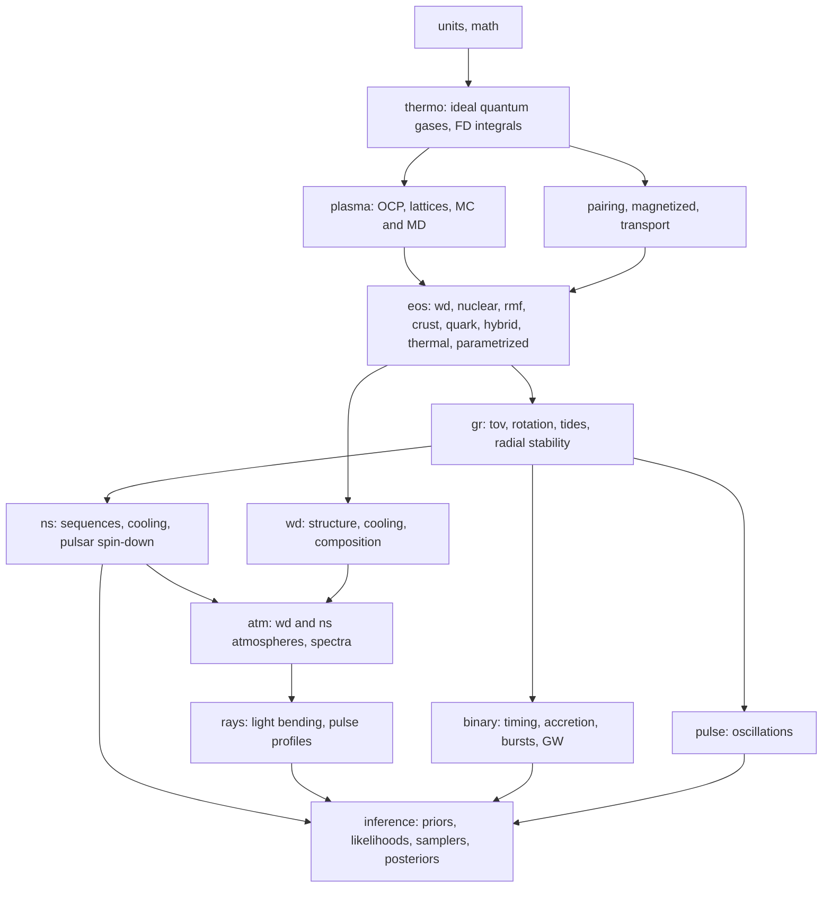

# Module 20: Capstone, an EOS-to-observables toolkit with Bayesian inference (`compactlite`)

**Difficulty:** Hard. **Time:** about 10 weeks of integration (the components are built along Modules 01 to 19).

## The theme

**`compactlite` is a modular, tested, documented Python framework that takes microphysics in and produces observables and inferences out:**

```
microphysics        ->   equation of state   ->   structure          ->   observables           ->   inference
(stat mech, nuclear,     (WD, nuclear, RMF,       (Newtonian WD,         (M, R, Lambda, I, Q,        (priors, likelihoods,
 crust, quarks)           crust, hybrid, hot)      TOV, rotation)         cooling curves, spectra,     samplers, posteriors)
                                                                          pulse profiles, timing)
```

It is the compact-object counterpart of the MESA-like code of Volume 1, and it is also the computational backbone of Volume 2 of your book: every problem solution should call into this library, and every equation of the book should point to the function and the test that verifies it. Volume 1's `starlite` can supply the white dwarf evolutionary inputs and the atmosphere tools.

> **Read this module first**, at the start of the program, and again at the end. It tells you what each earlier module's component must look like.

## Architecture



**Design principles.**
1. **A narrow EOS interface.** Every EOS is an object with `eos.P_of_eps(eps)` (or `P_of_n`, `eps_of_P`), `eos.sound_speed2(n)`, `eos.composition(n)`, a declared validity range and metadata (parameters, source, units), and a **thermodynamic consistency checker** that runs automatically on construction (Gibbs-Duhem, $\mu=\partial\epsilon/\partial n$, monotonicity, causality). Cold EOS, finite-$T$ EOS and parametrized EOS implement the same base classes.
2. **Functional core, thin classes.** Numerical routines (TOV, tides, rotation) are pure functions of arrays and callables; they are what you vectorize or JIT-compile. Classes hold configuration and caches.
3. **Units discipline.** One `units` module; internal choices documented (nuclear units MeV and fm for microphysics, geometric units for structure, cgs for white dwarfs and atmospheres), conversions only at API boundaries.
4. **Reproducibility.** Every run stores its configuration, code version and random seeds; EOS and data tables carry source and checksum metadata.
5. **Hooks and plug-ins.** New physics (a new EOS, a new atmosphere, a new likelihood) is added by registering a class, not by editing the core.

## Interfaces (sketch)

| Component | Function or class | Returns |
| --- | --- | --- |
| `thermo` | `ideal_fermi(mu, T, m, g)` | $n,P,\epsilon,s$, derivatives |
| `eos` | `EOS.from_params(name, **p)`; `EOS.from_table(path)` | EOS object with $P(\epsilon)$, $c_s^2$, composition |
| `gr.tov` | `solve_tov(eos, eps_c)`; `sequence(eos, eps_c_grid)` | $M,R,\Phi$, baryon number, binding energy, stability |
| `gr.rotation` | `moment_of_inertia(eos, eps_c)` | $I$, $Q$ (slow rotation) |
| `gr.tides` | `tidal_deformability(eos, eps_c)` | $k_2,\Lambda$ |
| `wd` | `white_dwarf(M, composition, Teff)`; `cooling_track(...)` | structure, $R$, cooling age, luminosity function |
| `atm` | `wd_spectrum(Teff, logg, ...)`; `ns_spectrum(Teff, logg, B, comp)` | spectra, color corrections |
| `rays` | `pulse_profile(M, R, spot, inclination, spin)` | flux vs phase and energy |
| `binary` | `post_keplerian(m1, m2, Pb, e)`; `burst_ignition(...)` | PK parameters, recurrence times |
| `inference` | `Posterior(eos_family, datasets, priors)`; `.sample(...)` | samples, evidence, predictive tools |

## Milestones

Each milestone ends with an automated test in `tests/` and a tagged release.

| Milestone | After module | Deliverable and test |
| --- | --- | --- |
| **M0** | 01 | Repository, CI, `units`, `math`, MCMC wrappers |
| **M1** | 02 | `thermo`: Fermi-Dirac, ideal gases with antiparticles, consistency checker |
| **M2** | 03 | `plasma`: OCP, lattice energies, Maxwell and Gibbs constructions |
| **M3** | 04 | `pairing`, `magnetized`, `transport` with their limits |
| **M4** | 05 | `wd.structure`: Chandrasekhar, Hamada-Salpeter, composition |
| **M5** | 06 | `gr.tov` verified against Schwarzschild interior and Tolman VII |
| **M6** | 07 | `ns.sequences`, piecewise polytropes, free-gas test |
| **M7** | 08, 09 | `eos.nuclear` and `eos.rmf` with published parameter sets reproduced |
| **M8** | 10 | `eos.crust` (BPS, liquid drop, unified matching) |
| **M9** | 11 | `eos.quark`, `eos.hybrid` with stability and third-family detection |
| **M10** | 12, 13 | `gr.rotation`, `gr.tides`, `pulse`, `ns.pulsar` |
| **M11** | 14 | `thermal`: WD and NS cooling |
| **M12** | 15, 16 | `atm.wd`, `atm.ns`, `rays` |
| **M13** | 17, 18 | `binary`, `eos.thermal` |
| **M14** | 19 | `inference` with mock-data calibration test |
| **M15** | all | Integration, validation report, documentation, first public release |

## Validation suite (verification and validation)

*Verification* shows that the code solves the equations correctly. *Validation* shows that its results agree with nature or with independent calculations.

| Test | Target (verify each against your sources) | Tolerance |
| --- | --- | --- |
| Fermi-Dirac and degenerate limits | $P=1.0036\times10^{13}(\rho/\mu_e)^{5/3}$, $1.2435\times10^{15}(\rho/\mu_e)^{4/3}$ | $10^{-8}$ |
| Thermodynamic consistency (every EOS) | Gibbs-Duhem, Maxwell relations, $\mu=\partial\epsilon/\partial n$ | $10^{-8}$ to $10^{-6}$ |
| Chandrasekhar mass | $M_{\rm Ch}=5.83/\mu_e^2\approx1.456\,M_\odot$ | $10^{-3}$ |
| White dwarf radius | $R(0.6\,M_\odot)\approx0.012\,R_\odot$; Sirius B redshift $\approx80$ km/s | few percent |
| TOV: incompressible star | exact Schwarzschild interior | $10^{-6}$ |
| TOV: free neutron gas | $M_{\max}\approx0.7\,M_\odot$ | $5\times10^{-2}$ |
| Tidal Love numbers | $k_2=0.75$ (homogeneous), $0.26$ ($n=1$ polytrope), Newtonian limits | $10^{-4}$ |
| Maximum-mass point | $dM/d\epsilon_c=0$ matches $\omega_0^2=0$ | $10^{-3}$ |
| Nuclear EOS saturation | $e(n_0)=-16$ MeV, $P(n_0)=0$, $K_0$ as input | $10^{-6}$ |
| RMF parameter sets | published $n_0$, $E/A$, $K_0$, $S_0$, $L$ | $1$ to $2$ percent |
| Crust | BPS sequence, neutron drip $\approx4\times10^{11}$ g/cm$^3$ | 10 percent |
| Unified EOS (SLy-like) | $M_{\max}\approx2.05\,M_\odot$, $R_{1.4}\approx11.7$ km | 3 percent |
| Moment of inertia | $I/MR^2\approx0.35$ for typical models; Newtonian limit | 5 percent |
| Pulsar diagnostics (Crab) | $B\approx4\times10^{12}$ G, $\tau_c\approx1.3$ kyr | 5 percent |
| Light bending | Beloborodov vs exact; visible fraction 76 percent at $1.4\,M_\odot$, 12 km | 3 percent |
| Binary pulsar | Hulse-Taylor $\dot\omega=4.226^\circ$/yr, $\dot P_b=-2.40\times10^{-12}$ | 1 percent |
| WD cooling | Mestel law $L\propto T_c^{7/2}$, cooling age to 5000 K of several Gyr | scaling exact; age 20 percent |
| Inference calibration | truth within 68 percent credible interval in about 68 percent of mock runs | binomial |
| Cross-code comparison | public EOS tables (CompOSE), RNS for rotation, published tidal deformabilities | 1 to 3 percent |

## Performance targets (indicative)

- A TOV sequence (200 central densities) in milliseconds with a tabulated EOS (Numba).
- $\ge10^3$ EOS per second end to end ($M$-$R$ and $\Lambda$) for inference; $10^5$ to $10^6$ samples feasible in an hour.
- Profile first: the usual hot spots are EOS interpolation, adaptive ODE stepping and likelihood evaluation (KDEs).

## Software engineering checklist

- Type hints, docstrings with units, formatting and linting in pre-commit.
- Unit tests (`pytest`), property-based tests (for example `hypothesis`) for thermodynamic identities, regression tests with stored reference outputs, benchmark tests.
- Continuous integration running the fast subset on every commit and the full validation suite on a schedule.
- Documentation (Sphinx or MkDocs) with a theory section linked to the book chapters.
- Reproducible environments and **data provenance** (source and checksum for every table).
- An open-source license, a changelog and semantic versioning.

## Risks and mitigations

| Risk | Mitigation |
| --- | --- |
| Thermodynamically inconsistent EOS | Mandatory consistency checker; failing EOS rejected at construction |
| Non-monotonic $P(\epsilon)$ at phase transitions | Explicit plateau representation; TOV solver with piecewise intervals |
| Stiff or non-causal parameter draws in inference | Cheap early-rejection tests before TOV |
| Tidal deformability errors at density discontinuities | Surface-discontinuity correction and a test with a quark star |
| Sampler too slow | Vectorize the forward model, precompute tables, importance resampling, emulators |
| Prior dependence of inference | Publish prior predictive plots and repeat with at least two parametrizations |
| Unit errors | One `units` module; unit tests of every conversion |
| Scope creep | Release at each milestone; mark rapid rotation, GR cooling and MHD as optional |

## Stretch goals

- A differentiable pipeline (JAX) to infer EOS parameters with gradient-based samplers.
- A full rapidly rotating star solver and a link to the public RNS code.
- A neural-network emulator trained on your TOV and tidal solutions.
- A hot-EOS module that accepts public tables (CompOSE format) and runs PNS and merger post-processing.
- Coupling to Volume 1's evolution code to follow white dwarf cooling with full atmospheres.
- A short software paper describing the framework and the validation.

## Final deliverables

1. The repository with all modules, tests and documentation.
2. A validation report: every row of the table above with the result and an explanation of discrepancies.
3. A library of EOS (white dwarf, nuclear, RMF, crust, hybrid, parametrized) with sources and metadata, and a set of precomputed $M$-$R$ and $\Lambda(M)$ curves.
4. An end-to-end inference notebook: mock data $\to$ posterior $\to$ predictive checks, and the real-data version.
5. A set of "book companion" notebooks: one per module.
6. A 15-minute talk outline and a limitations section.
